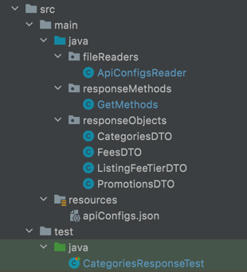

#Assurity Automation
This project contains the API test for Assurity request for further information.

###Technologies
* Java
* RestAssured
* TestNG
* Maven
* Git

###File Structure
* 

###File/Directory Content
* ApiConfigsReader - This class reads the json file containing the url content of the api request.
* responseObjects - This directory contains the object classes to map the API response.
* GetMethods - This class contains the getRequest method for the api. Any additional get methods can be added to this class.
* apiConfigs.json - This json file contains the url content of api.

###Notes:
* Please refer comments within classes for further clarification.